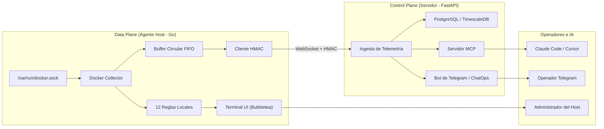

# SOLV

**Observabilidad activa, AIOps y ChatOps para infraestructura Docker On-Premise.**

[](https://github.com/AlvaroRiveraCarhuani/server_tracker/releases)
[](https://github.com/AlvaroRiveraCarhuani/server_tracker/actions)
[](LICENSE)
[](agent/go.mod)

**Idiomas:** [English](README.md) | [Español](README.es.md)

---

## 1. Qué es SOLV

SOLV es una plataforma de observabilidad activa y AIOps diseñada para servidores Docker. Monitorea continuamente la salud y signos vitales de los contenedores con un consumo menor al 0.1% de CPU, correlaciona fallos en cascada en incidentes unificados, diagnostica causas raíz mediante una cascada de degradación en 4 niveles (IA profunda -> IA rápida -> 12 reglas determinísticas fuera de línea -> métricas puras), y ofrece flujos de remediación seguros con cero ejecución remota de comandos arbitrarios (RCE) y cero archivos `.env` en texto plano en el host.

**Capacidades principales:**
- Agente en Go ultraligero (<0.1% CPU, socket Unix directo, buffer circular).
- Cascada de degradación en 4 niveles ([AI] / [AI~] / [RULE] / [SIG]) para diagnóstico 100% desconectado.
- Cero RCE: lista blanca estricta de acciones (restart, stop, isolate) con modales de confirmación interactivos.
- Correlación de incidentes: agrupa caídas en cadena en un único incidente con inferencia de origen causal.
- Bóveda cifrada: cero archivos `.env`; clave AES-256-GCM derivada con Argon2id y fallback al Keyring del sistema operativo.
- Totalmente bilingüe (español/inglés) en TUI, reglas, directivas de IA y ChatOps.

---

## 2. Instalación Rápida

Instala el agente oficial mediante el script instalador automatizado:

```bash
curl -sSL https://AlvaroRiveraCarhuani.github.io/server_tracker/install.sh | sh
```

El instalador realiza las siguientes tareas:
1. Detecta tu sistema operativo y arquitectura de CPU.
2. Consulta tu preferencia de idioma (español o inglés).
3. Descarga el paquete de release y verifica su suma criptográfica SHA256.
4. Instala `solv-agent` y `solv-update` en `/usr/local/bin` (o `~/.local/bin`).
5. Inicializa la configuración gestionada en `~/.solv/config`.

Inicia la terminal interactiva:

```bash
solv-agent --mode=tui
```

---

## 3. Instalación Manual

Para entornos aislados u operadores que prefieran verificación criptográfica manual:

1. Descarga el paquete y su archivo de checksum desde [GitHub Releases](https://github.com/AlvaroRiveraCarhuani/server_tracker/releases/latest):
   ```bash
   curl -LO https://github.com/AlvaroRiveraCarhuani/server_tracker/releases/download/v1.0.0/solv-agent-linux-amd64.tar.gz
   curl -LO https://github.com/AlvaroRiveraCarhuani/server_tracker/releases/download/v1.0.0/solv-agent-linux-amd64.tar.gz.sha256
   ```

2. Verifica la integridad criptográfica:
   ```bash
   sha256sum -c solv-agent-linux-amd64.tar.gz.sha256
   ```

3. Descomprime y mueve los binarios a tu `$PATH`:
   ```bash
   tar -xzf solv-agent-linux-amd64.tar.gz
   sudo mv solv-agent /usr/local/bin/
   sudo mv solv-update /usr/local/bin/
   ```

---

## 4. Uso

### Modo TUI Interactivo
```bash
solv-agent --mode=tui
```
- `j` / `k` o `↑` / `↓`: Navegar lista de contenedores.
- `d`: Ver diagnóstico detallado, evidencias y acciones sugeridas.
- `n`: Inspeccionar dependencias de red y conexiones entre contenedores.
- `t`: Abrir panel de preferencias (cambio de tema e idioma).
- `Tab`: Conmutar modo de diagnóstico de IA (AUTO / FAST / DEEP / MANUAL).
- `?`: Abrir ayuda con catálogo de atajos de teclado.

### Modo Daemon en Segundo Plano
```bash
solv-agent --mode=daemon
```
Se ejecuta como servicio continuo transmitiendo métricas vía WebSocket con firmas HMAC-SHA256 hacia el Control Plane de FastAPI.

### Configuración Inicial de Credenciales
```bash
solv-agent --mode=onboarding
```
Guía la configuración interactiva de URL del servidor y tokens dentro de la bóveda cifrada.

---

## 5. Plataformas Soportadas

| Plataforma | Arquitectura | Nivel de Soporte | Notas |
|------------|--------------|------------------|-------|
| Linux | amd64 (x86_64) | Oficial | Objetivo principal de producción. Probado en Ubuntu 22.04+, Debian 12+. |
| Linux | arm64 (aarch64) | Oficial | Probado en AWS Graviton y Raspberry Pi 4/5. |
| macOS | arm64 (Apple Silicon) | Best effort | Binario provisto; reportes de comunidad bienvenidos. |
| macOS | amd64 (Intel) | Best effort | Binario provisto; reportes de comunidad bienvenidos. |
| Windows | cualquiera | No soportado | Sin soporte nativo; ejecutar dentro de WSL2 con Docker Desktop. |

**"Best effort"** indica que los binarios precompilados se distribuyen públicamente pero no se prueban activamente en cada tag de release por el mantenedor.

---

## 6. Sistema de Actualizaciones

SOLV desacopla el mecanismo de actualización del ejecutable principal para prevenir fallas o vulnerabilidades de auto-update:

```bash
solv-update
```

El script de actualización:
1. Consulta la API de GitHub para obtener la última versión publicada.
2. Compara contra la versión instalada (`~/.solv/version`).
3. Descarga el paquete y valida el checksum SHA256.
4. Genera una copia de seguridad del ejecutable actual.
5. Reemplaza el binario atómicamente y realiza una prueba de inicio (`--version`).
6. Ejecuta un rollback automático si el nuevo binario no arranca correctamente.
7. Reinicia el servicio systemd `solv-agent.service` si se encuentra activo.
8. Mantiene intactos tus archivos de configuración y bóveda cifrada.

---

## 7. Configuración

Toda la configuración reside en `~/.solv/` con permisos estrictos `0600`:

```
~/.solv/
├── config          # Preferencias de usuario (JSON)
├── vault.enc       # Credenciales cifradas (AES-256-GCM + Argon2id)
├── version         # Tag de versión instalada
└── crash.log       # Registro de restauración de pánicos (si se activa el trap)
```

**Política de Seguridad D2 (Cero .env):** Las credenciales y claves de API nunca se almacenan en texto plano en archivos `.env` ni variables de entorno del host. Se utiliza el Keyring del sistema operativo (SecretService / D-Bus), con fallback seguro al archivo local cifrado.

---

## 8. Arquitectura



---

## 9. Rendimiento

Métricas obtenidas en un benchmark de producción con 20 contenedores activos:

| Componente | CPU Promedio | Memoria RAM | Sobrecarga de Red |
|------------|--------------|-------------|-------------------|
| `solv-agent` (daemon) | 0.08% | 12 MB | ~2 KB/s |
| `solv-agent` (TUI activa) | 0.25% | 14 MB | N/A (socket local) |
| `solv-server` (FastAPI) | 0.45% | 45 MB | ~5 KB/s por host |

---

## Contribución

Por favor revisa [CONTRIBUTING.md](CONTRIBUTING.md) para conocer las pautas de estilo de código, pruebas y cobertura requeridas.

---

## Seguridad

Para reportar vulnerabilidades de seguridad, consulta [SECURITY.md](SECURITY.md). Todos los reportes se gestionan en privado y se corrigen en un plazo máximo de 48 horas.

---

## Licencia

Este proyecto es código abierto bajo los términos de la [Licencia MIT](LICENSE).
