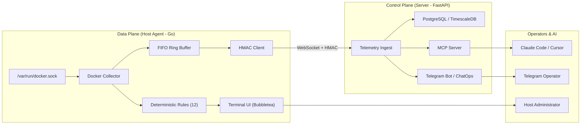

# SOLV

**Active observability, AIOps, and ChatOps for on-premise Docker infrastructure.**

[](https://github.com/AlvaroRiveraCarhuani/server_tracker/releases)
[](https://github.com/AlvaroRiveraCarhuani/server_tracker/actions)
[](LICENSE)
[](agent/go.mod)

**Languages:** [English](README.md) | [Español](README.es.md)

---

## 1. What is SOLV?

SOLV is an on-premise observability and AIOps platform built for Docker hosts. It continuously monitors container health and vital metrics with sub-0.1% CPU overhead, correlates cascading failures into unified incidents, diagnoses root causes using a 4-level fallback (Deep AI -> Fast AI -> 12 deterministic offline Docker rules -> raw telemetry), and provides safe remediation workflows with zero arbitrary remote code execution (RCE) and zero plaintext `.env` secret files on the host.

**Key capabilities:**
- Ultra-lightweight Go agent (<0.1% CPU, raw Docker socket, ring buffer).
- 4-level degradation cascade ([AI] / [AI~] / [RULE] / [SIG]) for 100% offline root-cause detection.
- Zero RCE: strict remediation whitelist (restart, stop, isolate) with interactive confirmation modals.
- Incident correlation: aggregates cascading container failures into a single incident with causal origin inference.
- Encrypted vault: zero `.env` files; AES-256-GCM + Argon2id keyring fallback.
- Fully bilingual (English/Spanish) across TUI, rules, AI directives, and ChatOps.

---

## 2. Quick Start

Install the official host agent using the automated installer:

```bash
curl -sSL https://AlvaroRiveraCarhuani.github.io/server_tracker/install.sh | sh
```

The installer will:
1. Detect your operating system and CPU architecture.
2. Prompt for your preferred language (Spanish or English).
3. Download the release archive and verify its SHA256 cryptographic checksum.
4. Install `solv-agent` and `solv-update` into `/usr/local/bin` (or `~/.local/bin`).
5. Initialize managed configuration in `~/.solv/config`.

Launch the interactive terminal workspace:

```bash
solv-agent --mode=tui
```

---

## 3. Manual Installation

For isolated environments or operators who prefer manual cryptographic validation:

1. Download the archive and checksum file from [GitHub Releases](https://github.com/AlvaroRiveraCarhuani/server_tracker/releases/latest):
   ```bash
   curl -LO https://github.com/AlvaroRiveraCarhuani/server_tracker/releases/download/v1.0.0/solv-agent-linux-amd64.tar.gz
   curl -LO https://github.com/AlvaroRiveraCarhuani/server_tracker/releases/download/v1.0.0/solv-agent-linux-amd64.tar.gz.sha256
   ```

2. Verify the checksum:
   ```bash
   sha256sum -c solv-agent-linux-amd64.tar.gz.sha256
   ```

3. Extract and place the binaries in your `$PATH`:
   ```bash
   tar -xzf solv-agent-linux-amd64.tar.gz
   sudo mv solv-agent /usr/local/bin/
   sudo mv solv-update /usr/local/bin/
   ```

---

## 4. Usage

### Interactive TUI Mode
```bash
solv-agent --mode=tui
```
- `j` / `k` or `Up` / `Down`: Navigate container list.
- `d`: View detailed container diagnosis, evidence, and remediation actions.
- `n`: Inspect network dependencies and inter-container connections.
- `t`: Open preferences modal (themes and language toggle).
- `Tab`: Cycle AI diagnosis mode (AUTO / FAST / DEEP / MANUAL).
- `?`: Open help and keyboard shortcut reference.

### Background Daemon Mode
```bash
solv-agent --mode=daemon
```
Runs continuously in the background, streaming metrics via WebSocket with HMAC-SHA256 signatures to the FastAPI control plane.

### Configuration Onboarding
```bash
solv-agent --mode=onboarding
```
Guides setup of server URL and authentication tokens into the encrypted vault.

---

## 5. Platform Support

| Platform | Architecture | Support Tier | Notes |
|----------|--------------|--------------|-------|
| Linux | amd64 (x86_64) | Official | Validated on Ubuntu 22.04+, Debian 12+, RHEL 9+ |
| Linux | arm64 (aarch64) | Official | Validated on AWS Graviton, Raspberry Pi 4/5 |
| macOS | arm64 (Apple Silicon) | Best effort | Binary provided; community reports welcome |
| macOS | amd64 (Intel) | Best effort | Binary provided; community reports welcome |
| Windows | any | Unsupported | Not supported natively; run inside WSL2 |

**"Best effort"** means precompiled binaries are distributed but not actively tested on every release. Community feedback and PRs are welcome.

---

## 6. Updates

SOLV separates the update mechanism from the agent executable to prevent auto-update vulnerabilities:

```bash
solv-update
```

The updater script:
1. Queries the GitHub API for the latest release tag.
2. Compares against the installed version (`~/.solv/version`).
3. Downloads the archive and verifies the SHA256 checksum.
4. Creates a safety backup of the active executable.
5. Replaces the binary atomically and performs a startup smoke test (`--version`).
6. Rolls back automatically if the new binary fails to start.
7. Restarts `solv-agent.service` via systemd if currently active.
8. Preserves your vault and configuration files intact.

---

## 7. Configuration

All configuration is managed inside `~/.solv/` (0600 permissions):

```
~/.solv/
├── config          # Managed user preferences (JSON)
├── vault.enc       # Encrypted credentials (AES-256-GCM + Argon2id)
├── version         # Installed release tag
└── crash.log       # Panic trap restoration log (if triggered)
```

**Security Policy D2 (Zero .env):** Credentials and API keys are never written to unencrypted `.env` files or environment variables on the host. When available, the system uses OS Keyring (SecretService / D-Bus), with transparent fallback to the local encrypted file.

---

## 8. Architecture



---

## 9. Performance

Metrics gathered on a production benchmark with 20 active containers:

| Component | Average CPU | RAM Resident | Network Overhead |
|-----------|-------------|--------------|------------------|
| `solv-agent` (daemon) | 0.08% | 12 MB | ~2 KB/s |
| `solv-agent` (TUI active) | 0.25% | 14 MB | N/A (local socket) |
| `solv-server` (FastAPI) | 0.45% | 45 MB | ~5 KB/s per host |

---

## Contributing

Please review [CONTRIBUTING.md](CONTRIBUTING.md) for pull request requirements, code style, and test coverage standards.

---

## Security

To report security vulnerabilities, see [SECURITY.md](SECURITY.md). All disclosures are handled privately and patched within 48 hours.

---

## License

This project is open source under the terms of the [MIT License](LICENSE).